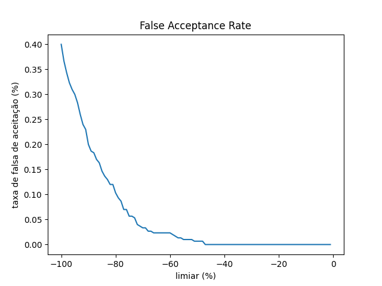
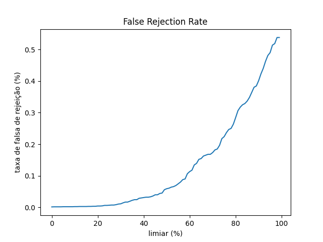
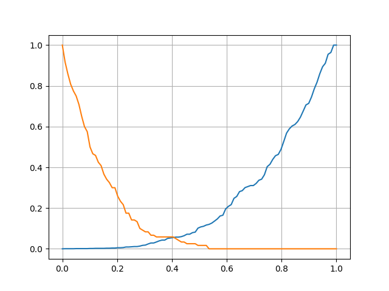

# Desafio TechCore
> Realizar um Branchmark de metricas usando a frAPI
----------------------------------------------------


<div display="flex">
   
   
   
</div>


## :rocket: Tecnologias utilizadas
 <div display="flex">
   
</div>

## :information_source: Instalação do projeto

> para isso você deve ter o [Python](https://www.python.org/) instalado na sua máquina:

### Faça o clone do repositório.
```bash
$ git clone https://github.com/joao-paulomoura/face_verification_frAPI.git
```
### Na pasta do projeto(./face_verification_frAPI) execute o programa:
```bash
$ python main.py
```
 
### Após isso siga as instruções no terminal

<br/>
<br/>

---
#### Se quiser bater um papo, deixo aqui minhas redes sociais:
- [LinkedIn](https://www.linkedin.com/in/jpaulomouradev/)
- [GitHub](https://github.com/JPauloMoura)
- [FaceBook](https://www.facebook.com/joaopaulo.pereirademoura/)
